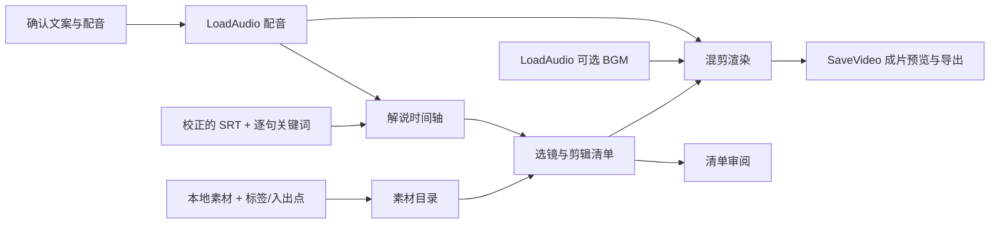

# 解说混剪 · 一期

目标：在 ComfyUI 中把**已确认的解说、配音、时间字幕和本地素材**变成可检查、可修改、可导出的混剪。先把剪辑决策做清楚，再接自动文案、配音和视觉理解。

参考项目按 [MoneyPrinterTurbo](https://github.com/harry0703/MoneyPrinterTurbo) 理解。2026-09-19 查阅其 [task.py](https://github.com/harry0703/MoneyPrinterTurbo/blob/main/app/services/task.py) 和 [video.py](https://github.com/harry0703/MoneyPrinterTurbo/blob/main/app/services/video.py)：借鉴文案、素材、配音、字幕、合成的阶段划分；本节点包独立实现，不依赖或启动该项目。

## 好的解说混剪需要什么

| 步骤 | 要解决的问题 | 建议的完成标准 |
| --- | --- | --- |
| 1. 明确主题与受众 | 观众为什么看、看完得到什么 | 一条视频只讲清一个核心观点；确定平台、画幅和目标时长 |
| 2. 写解说和叙事结构 | 开场、展开、证据、收束 | 开头约 3 秒给问题/冲突/结果；每句话有信息推进，结尾有答案或行动 |
| 3. 建立素材库 | 有哪些可用画面，哪一段能用 | 记录文件、入出点、人物/场景/动作标签；人工确认内容和来源 |
| 4. 确认配音与字幕 | 声音自然、字幕准确 | 先听配音，再校正 SRT；以真实音频和时间戳决定时长，不按字数猜时间 |
| 5. 逐句选镜和排节奏 | 画面是否支持正在说的话 | 按标签或指定镜头匹配；控制镜头长度，避免反复使用同一镜头 |
| 6. 画面与声音处理 | 主体完整、解说清楚 | 统一画幅与帧率；保留主体；背景音乐压低，讲话时进一步降低 |
| 7. 字幕与包装 | 手机端能看清 | 中文字体、描边、底部安全区；短句优先；一期以硬切和字幕为主 |
| 8. 审片与导出 | 技术成功不等于内容好看 | 审核选镜清单，再全片观看，确认语义、节奏、裁切、字幕和音量 |

“开头 3 秒”“镜头约 2–4 秒”是起点，不是所有题材的硬规则。剧情、情绪和完整动作优先。转场、特效、补帧不能替代叙事和匹配。

## 能力与节点对照

以下“已安装”来自本机运行服务的 `object_info` 和源码；“可选”仅完成文档调研，没有安装或实跑。

| 能力 | 现有支持 | 一期采用 | 需要自定义的部分 |
| --- | --- | --- | --- |
| 文案/镜头需求生成 | 已安装 `GeminiNode` / `GeminiNodeV2`，属于付费 API 节点 | 人工确认文案，SRT 保存最终口播文本，方向 JSON 保存逐句关键词 | 无需重写 LLM；后续把结构化输出接入方向 JSON |
| 配音 | 已安装 `ElevenLabsTextToSpeech`、`FishAudioTextToSpeech`；可选 [EdgeTTS](https://github.com/1038lab/ComfyUI-EdgeTTS) | 原生 `LoadAudio` 导入配音 | 无需重写 TTS；TTS 输出的 `AUDIO` 可替换 LoadAudio |
| 识别/时间对齐 | 已安装 `ElevenLabsSpeechToText` 输出词时间 JSON；可选 [ComfyUI-Whisper](https://github.com/yuvraj108c/ComfyUI-Whisper) 支持对齐/SRT 导出 | 导入人工确认的 SRT 正文 | `RemixNarrationPlan` 解析 SRT、核对音频时长，并附加选镜意图；不是 ASR 或强制对齐模型 |
| 素材加载与裁切 | 已安装 `LoadVideo`、`VideoTrim`、`VideoCrop`、数据集加载节点；可选 [VideoHelperSuite](https://github.com/Kosinkadink/ComfyUI-VideoHelperSuite) | 素材目录 + 人工标注的可用片段 | `RemixFootageCatalog` 输出含标签、区间、尺寸的素材目录；现有加载节点不包含这套剪辑元数据 |
| 内容理解/检索 | Gemini 可参与理解；通用视频加载不等于理解 | 人工标注标签，精确标签匹配，支持指定片段 ID | 不冒充视觉语义检索；镜头检测、VLM 自动打标、向量召回留待后续 |
| 镜头编排 | 现有裁切/拼接可以执行操作，不负责选择哪个片段 | 按字幕时间和标签选片、限制镜头时长、优先错开重复片段 | `RemixEditDecision` 生成帧对齐 EDL（剪辑清单），支持按句覆盖选镜 |
| 音量/混音 | 已安装 `AudioAdjustVolume`、`AudioMerge` | 渲染时 FFmpeg 音量标准化、BGM 循环、淡出及人声侧链压低 | `RemixRender` 负责与时间轴统一；不重复创建基础音频节点 |
| 字幕/批量渲染 | Whisper 包有字幕渲染；本机 FFmpeg 没有 libass 字幕滤镜 | Pillow 生成透明中文字幕图层，FFmpeg 逐镜头叠加 | `RemixRender` 执行 EDL，逐片段处理，避免全片 IMAGE 张量占用内存 |
| 预览/导出 | 已安装 `PreviewAudio`、`SaveVideo` | 复用这两个原生节点，导出 H.264/AAC MP4 | 不另写视频保存/预览节点 |
| 质检 | 播放器和人工审片 | 清单报告提示无匹配、重复、长字幕；再人工审片 | 一期不宣称能自动评价语义、黑帧、模糊或成片质量 |

## 工作流



保存的两个画布：

- **解说混剪 · 01 选镜审阅**：只生成/显示剪辑清单，不渲染成片。先看是否选对镜头。
- **解说混剪 · 02 渲染导出**：同样的参数继续渲染。修改第一个画布的输入后，需要将相同输入同步到第二个画布；两个画布不是共享表单。

输入未准备前不能直接生成真实成片。示例的 9 秒字幕只是格式说明，不是已对齐的真实配音。

## 使用

1. 优先在 **LoadAudio** 中上传配音；手动复制时放到 `ComfyUI/input/voiceover.wav`，刷新页面后在下拉列表选择。当前原生 LoadAudio 的下拉列表只扫描 `input` 根目录，音频不要放进子目录；后台 API 能读取子目录并不代表页面能正确选择它。视频仍放进 `ComfyUI/input/remix/footage/`。
2. 在「解说时间轴」中粘贴与配音一致的 SRT。每段字幕的序号用于关联选镜方向。方向示例：

   ```json
   {
     "1": {"keywords": ["城市", "夜景"], "role": "hook"},
     "2": {"keywords": ["人物", "工作"], "role": "evidence", "clip_ids": ["working"]},
     "3": {"keywords": ["日出"], "role": "ending"}
   }
   ```

   `role` 供审片阅读，不参与自动剪辑。`clip_ids` 是该句的候选白名单；只有一个 ID 时会固定使用它。未写方向的句子用字幕文字和素材标签匹配。
3. 在「素材目录」中填写相对 `ComfyUI/input` 的目录，以及素材标注：

   ```json
   [
     {"id": "city", "file": "city.mp4", "in": 0, "out": 8, "tags": ["城市", "夜景"]},
     {"id": "working", "file": "work.mp4", "in": 1, "out": 9, "tags": ["人物", "工作"]},
     {"id": "sunrise", "file": "sunrise.mp4", "in": 0, "out": 7, "tags": ["日出"]}
   ]
   ```

   同一文件可以定义多个不同 ID、不同入出点。`out` 可省略，默认视频结束。标注为 `[]` 时扫描目录并使用文件名作为粗标签，建议正式混剪明确标注。
4. 运行「01 选镜审阅」，查看节点下方的清单：每个镜头的成片时间、来源入点、字幕、标签匹配和重复警告。默认遇到无关素材会提示补标签；选择 `fallback` 才允许使用其他素材，并在清单里标记。
5. 在「02 渲染导出」选择画幅、裁切方式。默认 `pad` 保全原画面；`crop` 为居中裁切，不会自动追踪人物。
6. 可添加原生 **LoadAudio** 加载音乐，连接渲染节点的 `bgm`。节点不接音乐也能运行。默认 BGM 增益 -22 dB，并在讲话时压低；需要听审调整。
7. `SaveVideo` 在节点内预览并保存 `ComfyUI/output/NarrationRemix/Final_*.mp4`。中间视频、SRT、EDL 和报告保存在 `ComfyUI/output/NarrationRemix/runs/<编号>/`。中间镜头随成功渲染清理；失败时保留便于排查。

节点代码位于 `ComfyUI/custom_nodes/narration_remix`。使用 ComfyUI 已有的 numpy/Pillow 和本机 FFmpeg/ffprobe，不安装新的 Python 包，不修改 ComfyUI 核心。

## 一期边界与后续顺序

一期：人工文案/配音/SRT、标签匹配、逐句选镜覆盖、硬切、统一画幅/帧率、中文烧录字幕、BGM、人声压低、MP4、可追溯剪辑清单。素材原声静音，适用于解说覆盖画面；不保留剧情对白。

接下来优先补：

1. 接现成 TTS + 字幕对齐节点，减少手工准备，但保留配音试听和 SRT 校正。
2. 场景切分 + VLM 标注，给素材库补人物、动作、景别、情绪和质量标签。
3. 语义检索 + 重排，在清单中展示候选与选中原因，保留人工换镜。
4. 人物主体重构图、节奏/情绪曲线、适量转场、黑帧和静音检测。

自动文案、TTS、ASR 和 VLM 不是没有可用节点，而是需要选定服务、确认输出契约并接入。当前工作流不会自动调用收费 API 或下载模型。

2026-09-19 初次安装两个画布，服务注册全部四个节点。随后用户明确要求实际运行，已使用项目内三段 H3 视频、本地中文合成解说、对应 SRT 和合成配乐完成端到端验证，并新增可直接运行的 **解说混剪 · 03 完整演示**。有配乐通过页面运行，无配乐通过 MCP 运行。

实跑修正了两处问题：LoadAudio 页面无法选择子目录音频；动态响度处理在本机产生音频时间戳跳变。现在先测量响度，再用固定增益处理原始采样，目标 -16 LUFS，峰值余量优先，保留后续 BGM 侧链压低。它不保证峰值受限时仍能达到目标响度。

样片 8.633 秒、720×1280、30 fps、H.264/AAC。两条分支完整解码、259 视频帧、AAC 时间戳连续；三个解说片段与原音频相关性检查的时移均为 0 ms（扫描步长 0.5 ms），字幕出现与间隙清除检查通过。默认 pad 的上下黑边是保全横屏素材的预期效果。

详见 [端到端验证记录](../../../artifacts/narration-remix/e2e/README.md)，[带配乐样片](../../output/NarrationRemix/Verified_WithBGM_00001_.mp4)。这次只验证一期已实现链路，自动文案、TTS/ASR 节点接入和长视频性能不在验证范围内。
