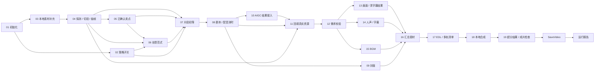

# 商品混剪 · 本地完整工作流

根据[引用会话](thread://01a0b54c-9397-7421-a94b-e7ee4bae61fb)中的 19 阶段 DAG 建立本地 ComfyUI 工作流。实现前已完成[节点核对](NODE_PLAN.md)：新增业务节点和数据适配，复用原生 SaveVideo、已有 RemixRender 及 Codex/H3 的扩展接口。

**本地实际执行**：素材去重、探测、按标注或画面变化切段、抽帧、标签初筛、本地创意库匹配、剧本输入/模板、中文 TTS 与真实时长校准、封面排版、声音时间轴、句级字幕、BGM、FFmpeg 合成及 MP4 保存。

**需要外部真实结果或另行接通的能力**：商品历史/直播素材召回、ASR/VLM 自动理解、线上创意库、生成式封面/AIGC、声音分离/复刻、清字幕、AI 超分。相应阶段保留输入与检查；缺少必需结果会失败并记录原因。默认画布不发起内部 RPC 或收费推理。

所有源码和产物位于 `short-drama` 项目。运行无需启动 `shop_content_creation`，不调用 CreateAIVideo/CronRemixVideo，不写其数据库、部署服务或发布视频。生产的 Redis 抢占、Eino/ABase 检查点、MQ 回调和 VID 入库属于服务端基础设施；本地使用 ComfyUI 队列和落盘阶段记录，不具备生产任务恢复语义。

## 打开与运行

启动项目根目录 `./start-comfyui.command`，在 http://127.0.0.1:8188 的“工作流”中打开：

| 画布 | 执行方式 |
| --- | --- |
| **商品混剪 · 01 本地完整流程** | 可直接运行的本机演示，使用项目已有猫咪素材、macOS Tingting 配音和本地配乐 |
| **商品混剪 · 02 Codex 剧本接入** | 将片段初筛输出的任务和 Schema 接到现有 CodexTextGenerate，再进入旁白校准；运行会调用 Codex，受账号额度限制 |
| **商品混剪 · 03 RPC 契约回放** | 使用本地记录的结构化剧本响应验证接线。默认 `fixture`，不会连接内部服务 |

源码版画布在 [example_workflows](example_workflows)，对应 API 提交文件在 [api](api)。安装副本在 `ComfyUI/user/default/workflows`。节点代码位于 `ComfyUI/custom_nodes/product_remix`，不改 ComfyUI 核心。

本地演示中的“小猫的三段旅程”是已有素材的流程样例，不是实际商品案例。替换素材后，在第 01 节点修改 JSON。文件路径相对 `ComfyUI/input`，运行期间不会从任意 URL 下载文件。无需把凭据填进画布。



画布保留依赖分支；是否同时执行由 ComfyUI 调度决定。封面只生成一次；人声直接复用剧本阶段已测时的音频。所有后续节点关联同一个初始化结果，变更规格后重跑不会混用其他任务的时间轴。

## 输入契约

[完整示例](example_inputs/demo.json)包含商品、素材、策略、配音、配乐和资产映射。

- `product.selling_points`：已确认卖点，必填；`tags` 用于片段标签筛选，`audiences` 是受众描述。
- `materials`：每项含唯一 `id`、`file`、可选 `in/out`、`tags`、`description`、`narration`。其中描述、旁白、`transcript` 均来自提供的标注，不是本地视觉/语音识别结果。坏素材单独跳过，全部不可用时失败。
- `materials[].segments`：可显式指定多个 `{id,in,out,tags,description,narration}`；时间相对完整源文件。未指定时，`scene_detect:true` 使用 FFmpeg 画面变化检测（默认阈值 0.35），合并不足 0.8 秒的边界。它不实现语义切分。
- `creative_library`：本地创意条目及标签；匹配为空时记录降级。未提供剧本时，从排名最高的三个候选中按原素材顺序组织已确认旁白。需要语义创作可用 02 画布。
- `script`：可选，人工确认的剧本；08 节点的 `script_json` 连接输入优先于它。每个 block 包含 `id`、`clip_id`、`text`、`voice_mode`，可选 `duration`、`source_type`、`subtitle_policy` 和 `subtitle_mode`。
- `policy`：布尔开关 `creative_recall`、`cover`、`aigc`、`super_resolution`。AIGC 开关仅允许剧本使用 AIGC，不强制生成片段。
- `video`：支持 24/25/30 fps；默认 720×1280、`pad`。`crop` 是居中裁切。原始素材中的声音由以下人声策略控制。

### 声音与时长

| voice_mode | 行为 |
| --- | --- |
| `tts` | 逐句用本机 `say` 合成、解码为 48 kHz 双声道 PCM，实测时长。`voice.name/rate` 控制音色和语速 |
| `file` | 使用 `audio_file` 里的完整已确认旁白；可用 `audio_in` 跳过起始采样 |
| `original_vocal` | 必须提供已分离的 `audio_file`；需要明确 `audio_in` 与分镜窗口的关系 |
| `source_audio` | 保留所选源视频区间的整个音轨，包括其背景声；它不执行人声分离 |
| `none` | 静音，`text` 留空 |

未指定 `duration` 时按真实音频时长建立画面窗口；无声音则使用素材区间长度。窗口不足时最多加速至 1.1 倍；仍不够时尝试 block 的 `rewrites` 中最多两条**已确认备选台词**，然后失败。没有自动 LLM 重写。不会按字数估算字幕时间，不循环源片来掩盖素材不足。

字幕是逐句音频起止边界，不是词级强制对齐。`subtitle_mode` 支持 `generated/source/none`；`subtitle_policy` 支持 `none/erase`。新配音不能沿用未经校准的源字幕，擦除与使用源字幕不能同时开启。外部音频与所填文字是否内容一致仍需人工听审。

`bgm.file` 优先；否则可在 `bgm.library` 中提供 `{file,tags}` 按标签选择。缺少音乐时跳过。默认 -22 dB 并在人声出现时压低，片头片尾淡入淡出。无音量模型下载。

### AIGC、封面、清字幕和超分

- AIGC block：`source_type:"aigc"`、`clip_id` 和正数 `duration`。通过 `assets.aigc` 映射到本地生成文件。10 节点也接受现有 H3 节点的 `VIDEO`，单个输入对应一个 AIGC ID；多个结果用映射。当前并未复现业务服务里强制 Seedance 模板复刻的策略。
- 09 节点默认从所选素材抽帧排版中文标题；可把已有生图节点的 `IMAGE` 接入 `cover_image`。封面失败按原流程降级并记原因。`cover_seconds` 默认 0.6 秒，覆盖开头画面，不增加音频时长。
- 清字幕：`assets.erased:{"片段ID":"清字幕后的完整源文件.mp4"}`。保持原始时间轴，节点验证时长；本地不运行擦除模型。
- 超分：开启开关并提供 `assets.super_resolution`，要求与当前成片相同时长。保留合成视频的音轨，只替换视频流；不做 AI 超分计算。提供者需保证画面顺序、字幕和封面内容一致。

## Euler RPC 接口边界

读取了[用户提供的 Euler 文档](https://bytedance.larkoffice.com/docx/doxcntVKIIkEYcGdNuFIarJJcfc)，实现按真实 IDL 动态构造请求的独立节点：

1. `thriftpy2.load(..., module_name以_thrift结尾, include_dirs=[...])` 加载完整 IDL 和 include。
2. `euler.Client(IDL.Service, target, timeout=...)` 选择显式服务路由。
3. 递归构造结构体/list/map，检查字段名、必填字段和整数类型。
4. 显式设置 `Base.Caller`，GDPR 取环境变量或 `byteddps.get_token()`，放入 `Base.Extra['gdpr-token']`。
5. 检查 `BaseResp.StatusCode`，按 `response_path` 提取 JSON。二进制响应转为带 encoding 标记的 Base64。

文档中的 `import uler` 和小写 client 示例存在笔误，采用文档上下文的 `import euler`、`euler.Client`。该文档不提供具体混剪业务 IDL、权限和本机服务发现环境；[真实模式配置模板](example_inputs/rpc-profile.euler.example.json)保留了明确占位符，必须以服务实际定义替换，不能直接运行。

RPC 节点**不自动重试**，超时不代表服务端没有执行。它封装一次 RPC；异步提交的 RequestID 需要按实际接口另行查询，未实现生产 MQ 回调/检查点恢复。`fixture` 模式只验证请求匹配和响应数据接线，不能证明远端服务可用。

本次没有安装 Euler 包或发出真实内部 RPC。以后需要安装时，仅用 `ComfyUI/.venv/bin/python -m pip ...`，并保持服务认可的真实 IDL 字段编号和类型；不要根据文档片段猜造业务 IDL。凭据放在进程环境中，不写入 JSON、输出记录或代码。

## 产物和验证

最终视频由 SaveVideo 写到 `ComfyUI/output/ProductRemix/Final_*.mp4`。每次运行在 `ComfyUI/output/ProductRemix/runs/local-*/` 保存：

- 19 份阶段记录，含 success/skipped/failed 状态及参数摘要。
- 配音试生成文件、实际测时和备选台词记录、`voice-track.wav`。
- 抽帧、`cover.png`、`timeline.json`、`render.mp4`、可选 `enhanced.mp4`。
- `result.json` 和 `report.txt`；已有渲染器还保存 SRT、EDL、渲染审阅记录。

重新生成画布：

```bash
ComfyUI/.venv/bin/python ComfyUI/custom_nodes/product_remix/build_workflows.py
```

按本次用户明确要求验证（不改变项目默认不运行测试的约定）：

```bash
ComfyUI/.venv/bin/python ComfyUI/custom_nodes/product_remix/verify_local.py
ComfyUI/.venv/bin/python ComfyUI/custom_nodes/product_remix/verify_local.py --integration
```

第二条需先启动当前版本 ComfyUI，只提交本地工作流。覆盖配音校准、不截断旁白、错误分支、RPC 请求/鉴权/错误码、连线，以及真实 MP4 全量解码、帧数、音轨、时间戳与源人声相关性。可选分支使用明确标注的本地控制素材验证结果接入，不代表远程模型效果。

最新验证记录：[artifacts/product-remix](../../../artifacts/product-remix)。Codex 画布只做结构与连线验证；生成式接口、真实 Euler 服务、长视频压力和商品内容质量未做实测。
