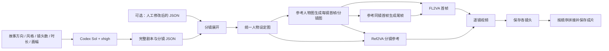

# 从方向到短剧视频

在 ComfyUI 中输入大致方向，由 Codex 完善完整剧本、人物设定和分镜，GPT Image 2 生成逐镜图片，再交给 MiniMax H3 生成各镜头，最后按顺序拼接成 MP4。新增工作流已经放入本机工作流列表。

| 工作流 | 图片与视频路径 |
| --- | --- |
| **短剧 · 00 剧本审阅** | 只完善并保存剧本与分镜 JSON，便于先审稿 |
| **短剧 · 01 完整生成（首尾帧 FL2VA）** | 人物设定图 → 每镜首帧 → 参考该首帧生成尾帧 → FL2VA 首尾帧生视频 → 拼接 |
| **短剧 · 02 完整生成（参考图 Ref2VA）** | 人物设定图 → 每镜分镜图 → 分镜图 + 人物设定图送 Ref2VA → 拼接 |



## 你需要填写的内容

打开任意完整工作流，在最左侧 **01 · 在这里填写故事方向** 中填写：

- `direction`：题材、人物、冲突、情绪、结尾，以及必须出现或不要出现的内容。
- `project_name`：产物目录的名称。
- `visual_style`：写实、动画等画风及统一的摄影要求。
- `shot_count`：镜头数量，默认 3。会自动逐镜执行，无需复制节点。
- `shot_seconds`：默认每镜 5 秒，可设 4–15 秒；默认总计划时长 15 秒。
- `ratio`：默认 16:9，同时决定分镜图尺寸与 H3 视频画幅。

例如：

> 30 岁女主下班后回到老家，在空屋里发现父亲留下的一封信。开始有悬疑感，中段发现父亲一直默默支持她，结尾温暖。人物不超过两人，不要恐怖画面；主要通过动作表达，少量中文对白。

**运行完整工作流会调用真实的 Codex、图片和 H3 视频服务。** 如需先修改剧本，先用 `00 剧本审阅`，把确认后的完整 JSON 粘到完整工作流 **03 · 分镜展开** 的 `edited_script` 中。填写修改稿后会跳过上游 Codex。镜头数须与创作规格一致；每镜时长可以在 JSON 内分别改为 4–15 秒整数。

## 默认配置

| 环节 | 默认值 | 修改位置 |
| --- | --- | --- |
| 大模型 | `gpt-5.6-sol`，`xhigh`（极高） | 02 的 `model` / `reasoning_effort` |
| 图片 | `gpt-image-2`，`medium`，每个任务 1 张 | 04、05、06 的模型和质量控件 |
| 图片尺寸 | 16:9 为 1280×720；其他画幅自动匹配 | 01 的 `ratio` |
| 视频 | MiniMax H3，768P，5 步 | 07 的 `inference_steps`，时长与画幅由分镜输入 |
| 拼接 | 24 FPS，按镜头顺序硬切，保留原声 | 09 的 `fps` |

图片节点的 `n` 保持 **1**：镜头数量由 `shot_count` 控制。`n` 是单个图片请求的候选图数量，不是镜头数。

以默认 3 个镜头为例，首次运行首尾帧版最多生成 **1 张人物图 + 6 张首尾帧 + 3 段视频**；参考图版为 **1 张人物图 + 3 张分镜图 + 3 段视频**。两个版本在方向、剧本和图片参数一致时可共用已生成的剧本、人物图和首帧。这里的“复用”不是两个画布共享表单；修改创作方向后需要把相同参数同步到另一个画布。

首尾帧版将两个独立画面分别连接到 `first_frame` / `last_frame`。参考图版将分镜图作为 `<Picture 1>`，人物设定图作为 `<Picture 2>`，调用 Ref2VA 通道，不把它当作首尾帧约束。人物参考可以降低跨镜头外观漂移，但不能保证生成画面绝对一致。

切换视频模式请打开对应的完整模板；只修改分镜节点的 `video_mode` 不会替换下游服务节点或重新连线。

## 启动与产物

先启动已有服务：

```bash
./start-merlin-h3.command
./start-comfyui.command
```

已经运行的服务无需重复启动。H3 门户为 `http://127.0.0.1:18082`，实际生成前确认所选 FL2VA 或 Ref2VA 通道有可用实例。图片节点使用现有 图片服务密钥，Codex 使用已有 CLI 登录；工作流文件不保存凭据。

结果位于：

```text
ComfyUI/output/ShortDrama/<项目名>/<剧本内容编号>/
├── script_*.json                   完整剧本、人物设定、逐镜描述
├── images/
│   ├── cast_*.png                  人物与美术参考
│   ├── shot-001-first_*.png        逐镜首帧/分镜图
│   └── shot-001-last_*.png         首尾帧版的逐镜尾帧
├── FL2VA/
│   ├── shot-001_*.mp4              独立镜头
│   └── final_*.mp4                 按顺序拼接的完整成片
└── Ref2VA/                        参考图版相同结构
```

视频声音由 H3 原生生成，拼接保留各镜头音轨；缺少声音的片段补静音。当前不包含独立 TTS、口型修正、配音对齐、字幕烧录或配乐混音。模型是否准确说出台词、人物声音跨镜头是否一致，仍需审片。

## 重跑与修改

- 完整工作流中的 Codex 和图片节点开启 `reuse_result`。相同输入优先读取成功缓存，不因重跑下游而重新生成。
- 想重写剧本：修改方向或 Codex 的 `generation_id`。想重画图片：修改对应图片节点的 `generation_id`。想重做视频：修改 H3 提交节点的 `generation_id`。这些编号不是模型随机种子。
- 只修改一个分镜的提示词时，未变化的图片仍可命中缓存；修改公共人物/美术设定会影响所有镜头。
- H3 会保留任务编号并复用相同请求；超时后可继续等待原任务，或打开已有的 **H3 按任务编号取回视频**。不要为“继续等待”而改视频编号。
- 成功生成的图片缓存位于 `ComfyUI/user/text_to_image/cache/`，剧本缓存位于 `ComfyUI/user/codex_text/cache/`。Save 节点重跑可能新增带序号的本地副本，不代表重复推理。
- 图片请求超时或生成成功但下载失败时，不会自动重试；再次运行可能创建新图片请求。ComfyUI 取消视频等待不会取消远端已提交任务。

## 实现与检查范围

新增三个编排节点：`ShortDramaBrief` 构造写作任务与 Schema；`ShortDramaShots` 校验和展开分镜列表；`ShortDramaJoin` 用 FFmpeg 拼接标准 VIDEO 列表。复用现有 Codex、图片服务、H3 和 Save 节点。文生图节点补充参考图生图，协议沿用项目已验证的 `images/edits` multipart 接入。没有修改 ComfyUI 核心或安装额外依赖。

2026-09-19 已确认新节点注册，两个完整画布均可在界面打开。三个 API 工作流通过本地 Comfy CLI 的节点/参数/连线静态检查，均为 0 错误、0 警告。按项目约定，本次没有运行测试套件，也没有提交真实剧本、图片或视频生成，因此不将结构检查当作端到端生成验证。

`api/` 是 API 格式，`example_workflows/` 是 UI 画布。需要重建模板时，在 ComfyUI 运行期间执行：

```bash
ComfyUI/.venv/bin/python ComfyUI/custom_nodes/short_drama/build_workflows.py
```

该命令会覆盖本节点包的示例及对应的三个已安装模板，不会执行生成。自己改好的画布请另存为新名称。

列表执行依据：[ComfyUI 数据列表](https://docs.comfy.org/zh-CN/custom-nodes/backend/lists)。
