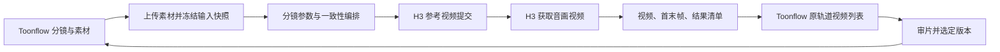

# Toonflow → ComfyUI 短剧分镜视频

Toonflow 负责剧本拆解、资产管理、分镜与审片；ComfyUI 接收一个分镜的完整快照，编排一致性约束、调用现有 Merlin H3 Ref2VA、保存视频和首末帧，再由 Toonflow 后台取回到原轨道视频列表。

这是单镜头生产接口。剧本不在 ComfyUI 内重新拆解；现有 `short_drama` 的“从创意到整剧”工作流可以独立使用。本联动节点位于 `ComfyUI/custom_nodes/toonflow_shots`，不修改 ComfyUI 核心，也不调用本机 GPU。

## 输入协议

完整机器定义：[request.schema.json](request.schema.json)。完整示例：[example_inputs/shot.json](example_inputs/shot.json)。示例文件名和全零 SHA-256 是待替换占位符，不能直接生成。

| 参数 | 内容 | 一致性用途 |
| --- | --- | --- |
| `schema_version` | 固定 `1.0` | 契约版本；未知字段拒绝，防止传了但没生效 |
| `request_id` | 全局唯一生成请求 ID | 重试沿用，改参数/新生成必须换 ID |
| `project_id / episode_id / shot_id / take` | 项目、剧集、镜头、版本 | 回传定位，避免结果串镜；Toonflow 用轨道 ID 标识镜头、videoId 标识版本 |
| `bible.version / style / director_notes / negative_prompt` | 设定版本、视觉风格、导演要求、禁止变化 | 同一组镜头保持一致；负面要求编入文本，不冒充模型独立负向参数 |
| `bible.entities[]` | `id/kind/version/name/description/wardrobe/voice/reference_ids` | 固定角色、场景、道具、音色和风格；ID 是身份，version 是造型/声音版本 |
| `shot.description / entity_ids` | 本镜头具体动作、出镜实体 | 每次只传本镜需要的设定，避免无关人物进入画面 |
| `shot.camera` | 景别、角度、运镜、焦段 | 保持镜头意图；不会替模型执行真实摄像机参数控制 |
| `shot.blocking / dialogue / sound` | 站位、逐字台词、说话人 ID、表演与环境声 | 台词说话人必须已绑定，避免角色声音混用 |
| `continuity` | 独立/接续、上一镜 ID/末帧、开场/收尾状态、轴线、方向、光线、时间 | 延续位置、动作、持物和空间关系 |
| `references[]` | 素材 ID、图片/视频/音频、相对路径、input/output、SHA-256、用途 | 固定素材内容、引用顺序和语义；文件变动立即报错 |
| `generation` | 模型、工作流版本、时长、画幅、768P、推理步数 | 固定技术规格，实际规格随结果返回 |

实体类型：`character / scene / prop / voice / style`。素材用途：`identity / wardrobe / scene / prop / voice / style / composition / continuity / motion`。

`bible.entities` 必须与 `shot.entity_ids` 对应；视觉实体必须绑定图片或视频，声音实体必须绑定音频。`match_previous` 必须提供上一镜 ID、用途为 continuity 的末帧图片以及非空的 `state_in/state_out`。输出的 `requested_state_out` 只记录目标状态，不代表模型已视觉验证该状态。

素材在提示词中按输入顺序、分类型编号为 `<Picture N>`、`<Video N>`、`<Audio N>`。Toonflow 编辑器中的 `@图N / @图片N / @视频N / @音频N` 自动转换；不存在的编号报错，不重新排序或静默丢弃。接续末帧追加在原素材之后，不改变已选素材编号。

本地 H3 服务固定 768P、4–15 秒整数，默认 5 步。Ref2VA 最多 9 图、3 视频、3 音频，总数最多 12；视频/音频每段 2–15 秒，各类合计不超过 15 秒。图片支持 PNG/JPEG/WebP，视频 MP4，音频 WAV/MP3。依据[官方 H3 规格](https://github.com/MiniMax-AI/MiniMax-H3/blob/d21241f0a4b3acbb34c97dae47fa417b7065e438/README.zh-CN.md#L80-L85)，实际路由约束以本地服务为准。

这里不提供 seed/LoRA/ControlNet 等未接入的参数。重复 seed 本来也不能替代角色参考；当前 H3 服务不暴露模型 seed。身份参考和末帧是生成约束，不能保证逐像素衔接或绝对一致。

## 已安装工作流

在 ComfyUI 的工作流列表打开 **短剧分镜 · Toonflow 一致性视频**。



三个联动节点：`ShortDramaPrepare`、`ShortDramaSubmit`、`ShortDramaResult`。生成与下载复用已有 `merlin_h3` 的提交实现、幂等记录和 `MerlinH3GetVideo` 节点。末帧通过 PyAV 顺序解码取得，不把整段视频转成 IMAGE 张量。

结果保存到 `ComfyUI/output/ToonflowShots/<request_id>/`：

- `video.mp4`：保留原生音轨。
- `first-frame.png / last-frame.png`：实际生成的视频首末帧。
- `result.json`：任务关联、文件 SHA-256、实际时长/帧率/尺寸/音轨、实体版本、警告和 `review_status=required`。

原输入、编排提示词、素材映射、H3 任务号保存到 `ComfyUI/user/toonflow_shots/jobs/<request_id>.json`。

## Toonflow 页面用法

1. 启动 `./start-comfyui.command`、`./start-merlin-h3.command`、`./start-toonflow.command`。H3 需要可用 Ref2VA 实例。
2. 供应商 **ComfyUI · 短剧一致性分镜** 已注册并启用。为需要此流程的项目选择其 **H3 · 短剧一致性分镜** 模型；现有项目模型不自动切换。
3. 在剧集视频工作台选择本镜角色定妆图、场景、道具、已绑定的角色音频和分镜图，填写分镜提示词。
4. 点击 **一致性设置**，填写设定版本、风格、镜头语言、站位/服装、起止状态、轴线和光线。设置按轨道保存，单次和批量生成都会读取。
5. 第一镜独立生成。审片后在视频列表中选定合适的版本；下一镜在一致性设置中选择这个上一镜。候选只包括同剧集其他轨道中用本工作流生成且已选定的版本。
6. 点击生成，任务异步进入 ComfyUI；结果下载并校验后显示在当前轨道的视频历史中。

Toonflow 自动把库资产 ID（衍生资产使用父资产 ID）作为稳定实体 ID，将描述和参考内容摘要作为版本。同一实体不允许同时选择两个冲突造型；已选择的角色音频按 `o_assetsRole2Audio` 的绑定关联到角色。没有音色绑定或没有角色定妆图时，不能视为完成了声音/身份锁定。

`take` 在 Toonflow 中使用唯一 videoId，表达生成版本，并非每条轨道从 1 递增的镜次。下一镜不会自动使用刚生成但尚未选定的结果；批量生成不会动态串接批次中尚未完成的前镜。需要动作连续时，按审片顺序逐镜生产。

供应商设置中的地址默认 `http://127.0.0.1:8188`，推理步数默认 5。H3 地址为工作流内的 `http://127.0.0.1:18081`。两者限本机 HTTP 根地址。

此供应商需要项目/轨道/素材绑定，因此设置页的通用模型试跑不适用，应从剧集视频工作台使用。

## API 与回传

ComfyUI：

1. 使用原生 `POST /upload/image` 上传素材（当前服务此接口也接受 MP4/WAV/MP3），保存返回的相对路径并计算素材 SHA-256。
2. `POST /short-drama/prepare`，body 为输入协议。只检查素材和参数，返回 `prompt` API 图、`input_hash`、`warnings`，不启动推理。
3. 将 `prompt` 交给原生 `POST /prompt`，可以传入预先持久化的 UUID `prompt_id`。
4. `GET /short-drama/jobs/<request_id>` 获取持久化任务与结果；运行错误和排队状态通过原生 `/history/<prompt_id>`、`/queue` 查询。
5. 通过 `/view?filename=...&subfolder=...&type=output` 下载结果，校验返回清单的 SHA-256。

独立调用可使用 [api/shot-video.json](api/shot-video.json)。仅准备参数用 [api/prepare-only.json](api/prepare-only.json)，只连接输入节点，仍需真实素材。

Toonflow 保持已有接口：`POST /api/production/workbench/generateVideo` 和 `batchGenerateVideo`，模型标识为 `comfyshortdrama:MiniMax-H3-ShortDrama`，结果仍由 `checkVideoStateList/getGenerateData` 返回到原视频列表。

新增配置接口 `POST /api/production/workbench/shortDramaSettings`：

```json
{"projectId":1,"scriptId":1,"trackId":1001}
```

省略 `settings` 时读取；携带 `settings` 时整体保存，返回 `{settings, previousVideos}`。网页表单覆盖常用字段；API 还可在 `settings.entityOverrides` 中按实体 ID 配置 `version/description/wardrobe/voice`，在 `settings.dialogue` 中配置 `speaker_id/text/delivery/kind`。字段定义见 `Toonflow-app/src/lib/comfyShortDrama.ts` 的 `dramaSettingsSchema`。

回传先将 MP4、首末帧和清单写到 Toonflow 自己的 `data/oss/<project>/video/`，再更新现有 `o_video/o_tasks` 状态。清单与视频同名 `.json`，包含本地 `videoUrl / firstFramePath / lastFramePath / comfyPromptId`；正常页面不依赖会过期的 H3 下载链接。不会自动替用户选择最终版本。

## 长任务与恢复

- Toonflow 在提交 ComfyUI 前，把工作流、输入摘要、请求 ID、ComfyUI UUID 写入现有 `o_tasks.relatedObjects`。后台每 5 秒扫描，网络错误退避重试，浏览器关闭不影响跟踪。
- ComfyUI 的队列不是幂等接口。提交响应丢失时先检查历史/队列；必要时可能重放同一个 API 图。真正的推理去重由固定 request_id 和 H3 既有幂等记录保证。
- ComfyUI 重启丢失内存队列后可重新入队，已提交的 H3 task 复用。已有 H3 提交响应不明确且超过 23 小时的保护不变，停止自动重新推理。
- 等待节点默认最多 120 分钟；取消 ComfyUI 只中止本地等待，不取消远端 H3。失败任务保留输入快照。
- 确认需要继续取回原结果时，可调用 `POST /api/production/workbench/resumeComfyVideo`，body 为 `projectId/scriptId/videoId`。它沿用 request_id 和 H3 task，分配新的 ComfyUI prompt_id。
- 如果 H3 本身生成失败，恢复不会偷偷生成新任务；需要新版本时点击生成，产生新的 videoId/request_id。
- 服务在上传准备阶段中断，重启后明确标记“尚未提交推理”，允许重新生成，不会一直卡在生成中。
- ComfyUI 一次执行一张图，等待视频期间后续分镜在 ComfyUI 排队；本版不声称并行推理。

## 安装与构建记录

2026-09-19：已安装节点、画布和 Toonflow 供应商，前后端已构建。ComfyUI 已加载三个新节点，API 工作流结构检查通过。遵循项目约定未运行测试套件、未提交真实推理；真实素材生成、回收和跨镜头视觉质量尚待实际使用确认。

```bash
ComfyUI/.venv/bin/python ComfyUI/custom_nodes/toonflow_shots/install.py
/usr/local/bin/node Toonflow-app/scripts/install-comfy-short-drama.cjs
```

当前 Toonflow 的 better-sqlite3 使用 Node ABI 127，因此启动器默认 `/usr/local/bin/node`（Node 22.17.0），可通过 `TOONFLOW_NODE_BIN` 指定兼容运行时。不重装依赖，不影响 ComfyUI 的 Python 3.12.10 虚拟环境。

代码改动后需重新生成 Toonflow 路由、构建后端；前端 `yarn build-only` 后复制 `dist/` 到 `Toonflow-app/data/web/`。安装日志与构建检查在 `artifacts/short-drama-integration/`。

编译检查：后端 TypeScript 检查通过；前后端构建通过。前端全量 `vue-tsc --build --force` 被仓库已有的 `src/views/production/components/workbench/generate copy.vue:1063` 语法错误阻塞；该旧副本不在应用构建入口中，本次未修改。

安装时的服务状态（2026-09-19）：ComfyUI、Toonflow、本地 H3 API/Worker 均已启动；H3 `/readyz` 的 shared 通道可推理，但本工作流使用的 `ref2va.inference_available=false`。当前不能完成参考生视频，需 Ref2VA 实例恢复后使用；未自动切换通道或降低一致性输入。具体快照见 `artifacts/short-drama-integration/installation.json`。
